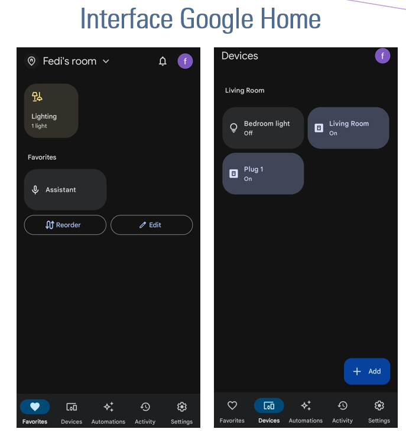

# 🏠 Smart Home Automation

### Overview
Developed a smart home system that integrates **voice assistants** and a **sipmle web interface** for IoT-based control of household devices.  
The system enables both local and remote management of lights, ventilation, and appliances.

### Features
- Seamless control via **Google Assistant and Alexa**
- ESP8266-based IoT architecture
- **web interface** for browser-based control
- Integration with smartphones, PCs, and voice commands
- Scalable for future addition of sensors and devices

### Tech Stack
ESP8266, HTML, CSS, Google Assistant, Alexa

### Media
- 📱 Google Home Interface: 
- 🌠Web Interface: 
- 🎥 [Demo Video 1](https://youtu.be/aaaa)
- 🎥 [Demo Video 2](https://youtu.be/bbbb)

### Contributions
- Designed the smart home IoT network on ESP8266
- Integrated voice assistants for natural interaction
- Built a simple web dashboard for universal accessibility
- Demonstrated real-time control of household devices
